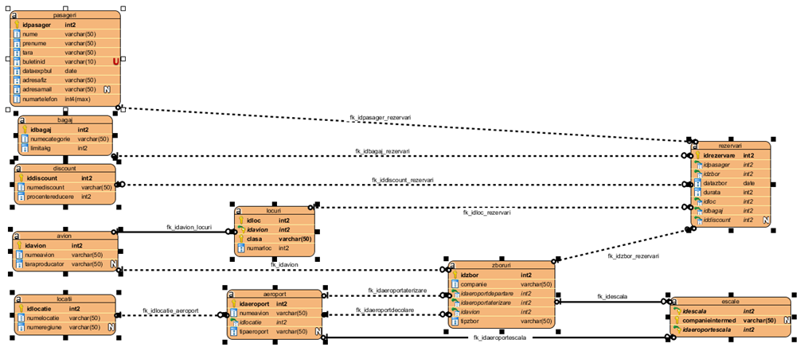

Here's a database i made for a uni project using PostgreSQL and R with tidyverse library.

Also i made 4 queries both in SQL and tidyverse:

    1.Get number of airports in each region
    2.Get planes that have more flights than AirbusA330
    3.Get first 3 dates of flights of each plane
    4.Concatenate in one line every city of each region.

